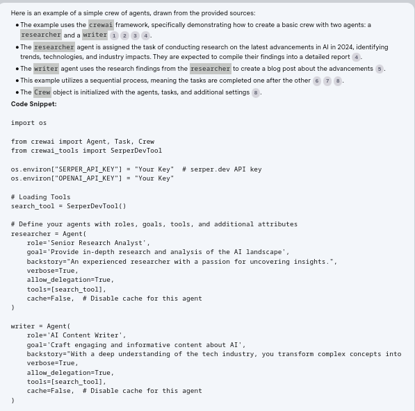
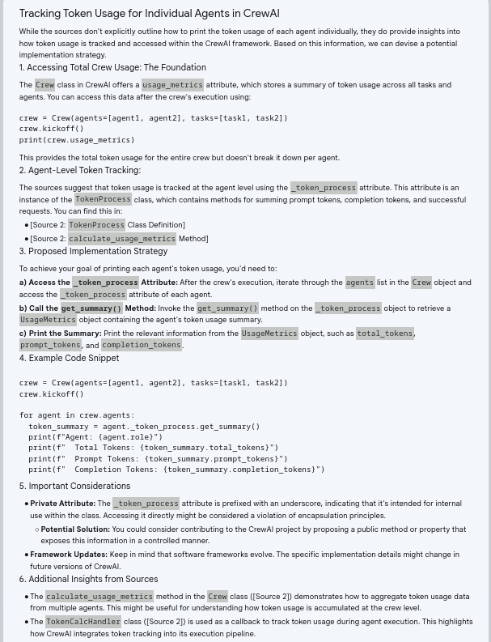

# Repo To Text

This repository contains a *Python* script designed to process a local GitHub repository by concatenating the contents of its files into text files, with a specified word limit per file. The script is useful for creating a consolidated view of a repository's content while excluding certain directories and file types.

You can upload these files to [Google NotebookLM](https://notebooklm.google/) to interact with the code and ask questions about implementations and other details.

## Features

- Processes all files in a specified repository.
- Skips specified directories and file patterns
- Concatenates file contents into text files with a maximum word limit.
- Outputs the processed content into numbered text files.
- Provides command-line options for customization.

## Requirements

- Python 3.x
- NLTK library

## Installation

1. Clone the repository:
   ```bash
   git clone https://github.com/jmlb/repoClerk.git
   cd repoClerk
   ```

2. Install the required Python packages:
   ```bash
   pip install -r requirements.txt
   ```

## Usage

Run the script using the following command:

```bash
python repo_to_text.py --cfg <path -to-config-yaml-file> --repo_path <path-to-repo> [options]
```

### Command-Line Options
- `--cfg `: Path to the config file with list of file extension or directory to skip from the processing
- `--repo_path`: Path to the local GitHub repository (absolute or relative).
- `-w`, `--max_words`: Maximum number of words per output file (default: 200,000).
- `-o`, `--output_dir`: Directory to save the output files (default: current directory).
- `--skip_patterns`: Additional file patterns to skip (e.g., `"*.md" "*.txt"`).
- `--skip_dirs`: Additional directories to skip.
- `-v`, `--verbose`: Enable verbose output.

### Example

```bash
python repo_concat.py --repo_path ./my_repo -w 100000 -o ./output --skip_patterns ".md" ".txt" --skip_dirs "tests" -v
```


## Use case: discussion with the crewAI repo

1. `git clone https://github.com/crewAIInc/crewAI.git`
2. run text repoTotext code: `python repo_to_text.py --cfg config.yaml --repo_path repos/crewai`
3. Upload the files to **NotebookLM** [https://notebooklm.google.com/](https://notebooklm.google.com/)

You are now ready to talk with the repo. Here are a few example of interactions nd response from NotebookLM

### Example1: Code implementation query

<details open>
<summary> Prompt / Response </summary>
**prompt**

Implement a random example of a crew of agents.


**response**

Here is an example of a simple crew of agents, drawn from the provided sources:

*   The example uses the `crewai` framework, specifically demonstrating how to create a basic crew with two agents: a `researcher` and a `writer`.
*   The `researcher` agent is assigned the task of conducting research on the latest advancements in AI in 2024, identifying trends, technologies, and industry impacts. They are expected to compile their findings into a detailed report.
*   The `writer` agent uses the research findings from the `researcher` to create a blog post about the advancements.
*   This example utilizes a sequential process, meaning the tasks are completed one after the other.
*   The `Crew` object is initialized with the agents, tasks, and additional settings.

**Code Snippet:**

```python
import os

from crewai import Agent, Task, Crew
from crewai_tools import SerperDevTool

os.environ["SERPER_API_KEY"] = "Your Key"  # serper.dev API key
os.environ["OPENAI_API_KEY"] = "Your Key"

# Loading Tools
search_tool = SerperDevTool()

# Define your agents with roles, goals, tools, and additional attributes
researcher = Agent(
    role='Senior Research Analyst',
    goal='Provide in-depth research and analysis of the AI landscape',
    backstory="An experienced researcher with a passion for uncovering insights.",
    verbose=True,
    allow_delegation=True,
    tools=[search_tool],
    cache=False,  # Disable cache for this agent
)

writer = Agent(
    role='AI Content Writer',
    goal='Craft engaging and informative content about AI',
    backstory="With a deep understanding of the tech industry, you transform complex concepts into compelling narratives.",
    verbose=True,
    allow_delegation=True,
    tools=[search_tool],
    cache=False,  # Disable cache for this agent
)

# Create tasks for your agents
task1 = Task(
    description=(
        "Conduct a comprehensive analysis of the latest advancements in AI in 2024. "
        "Identify key trends, breakthrough technologies, and potential industry impacts. "
        "Compile your findings in a detailed report."
    ),
    expected_output='A detailed report on the latest AI advancements in 2024',
    agent=researcher,
)

task2 = Task(
    description=(
        "Craft a captivating blog post based on the provided research report. "
        "Highlight the most significant AI advancements, their implications, and future potential. "
        "Ensure the post is engaging, informative, and accessible to a broad audience."
    ),
    expected_output='A compelling 3 paragraphs blog post formatted as markdown about the latest AI advancements in 2024',
    agent=writer,
    context=[task1]  # Pass the output of task1 as context for task2
)

# Instantiate your crew with a sequential process
crew = Crew(
    agents=[researcher, writer],
    tasks=[task1, task2],
    verbose=True,
    memory=True,
    planning=True  # Enable planning feature for the crew
)

# Get your crew to work!
result = crew.kickoff()
print("######################")
print(result)
```

This example showcases the fundamental structure of creating a simple crew using the `crewai` framework. By defining roles, goals, and tasks for each agent, and configuring the `Crew` object, you can establish a basic multi-agent system for task automation.

</details>




### Example2: New functionality

<details open>
<summary>Prompt / Response </summary>

**prompt**

I want each agent within my multi-agent setup to log their individual token usage during interactions. How can I implement this functionality to monitor and print each agent's token usage after every interaction? Additionally, where in the existing code should this feature be integrated for optimal tracking and minimal performance impact? Please provide guidance on which methods or modules would be most appropriate to modify or extend to capture token usage data effectively.


**response**

## Tracking Token Usage for Individual Agents in CrewAI

While the sources don't explicitly outline how to print the token usage of each agent individually, they do provide insights into how token usage is tracked and accessed within the CrewAI framework. Based on this information, we can devise a potential implementation strategy.

### 1. Accessing Total Crew Usage: The Foundation

The `Crew` class in CrewAI offers a `usage_metrics` attribute, which stores a summary of token usage across all tasks and agents.  You can access this data after the crew's execution using:

```python
crew = Crew(agents=[agent1, agent2], tasks=[task1, task2])
crew.kickoff()
print(crew.usage_metrics)
```

This provides the total token usage for the entire crew but doesn't break it down per agent.

### 2. Agent-Level Token Tracking:  `_token_process`

The sources suggest that token usage is tracked at the agent level using the `_token_process` attribute. This attribute is an instance of the `TokenProcess` class, which contains methods for summing prompt tokens, completion tokens, and successful requests. You can find this in:

- [Source 2: `TokenProcess` Class Definition]
- [Source 2: `calculate_usage_metrics` Method]

### 3. Proposed Implementation Strategy

To achieve your goal of printing each agent's token usage, you'd need to:

**a) Access the `_token_process` Attribute:** After the crew's execution, iterate through the `agents` list in the `Crew` object and access the `_token_process` attribute of each agent.

**b) Call the `get_summary()` Method:** Invoke the `get_summary()` method on the `_token_process` object to retrieve a `UsageMetrics` object containing the agent's token usage summary.

**c) Print the Summary:** Print the relevant information from the `UsageMetrics` object, such as `total_tokens`, `prompt_tokens`, and `completion_tokens`.

### 4. Example Code Snippet

```python
crew = Crew(agents=[agent1, agent2], tasks=[task1, task2])
crew.kickoff()

for agent in crew.agents:
  token_summary = agent._token_process.get_summary()
  print(f"Agent: {agent.role}")
  print(f"  Total Tokens: {token_summary.total_tokens}")
  print(f"  Prompt Tokens: {token_summary.prompt_tokens}")
  print(f"  Completion Tokens: {token_summary.completion_tokens}")
```

### 5. Important Considerations

- **Private Attribute:** The `_token_process` attribute is prefixed with an underscore, indicating that it's intended for internal use within the class. Accessing it directly might be considered a violation of encapsulation principles.  

    - **Potential Solution:** You could consider contributing to the CrewAI project by proposing a public method or property that exposes this information in a controlled manner.

- **Framework Updates:** Keep in mind that software frameworks evolve. The specific implementation details might change in future versions of CrewAI.

### 6.  Additional Insights from Sources

- The `calculate_usage_metrics` method in the `Crew` class ([Source 2]) demonstrates how to aggregate token usage data from multiple agents. This might be useful for understanding how token usage is accumulated at the crew level.

- The `TokenCalcHandler` class ([Source 2]) is used as a callback to track token usage during agent execution. This highlights how CrewAI integrates token tracking into its execution pipeline.

By combining the insights from the sources and the proposed implementation strategy, you should be able to enhance the CrewAI framework to provide more granular visibility into agent-level token usage, allowing for better resource monitoring and optimization. 

</details>


